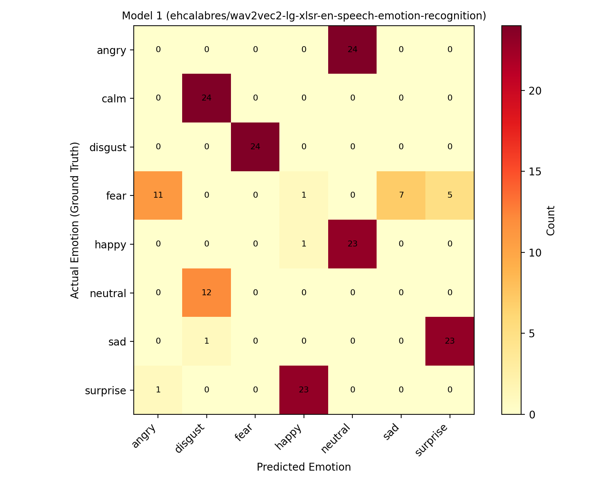
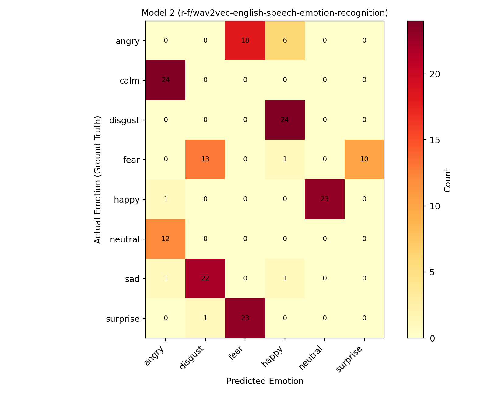
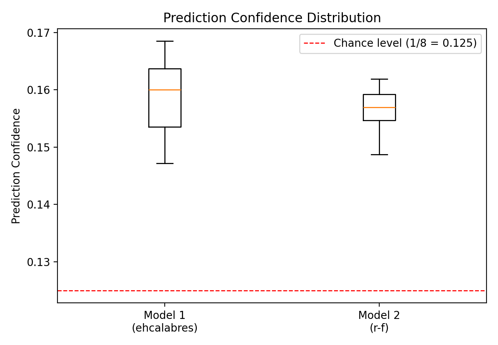

# Lab Assignment 3: Speech Emotion Recognition Systems

MIS 425 — Spring 2026 — Dr. Mary Pourebadi

*Group Members: Christina Oftedal, \[Name 2\], \[Name 3\], \[Name 4\]*

***\[NOTE TO FILL IN:** Replace the placeholder names above with all
group members exactly as required by the syllabus before
submitting.**\]***

## 1. Logistics

This report is submitted in fulfillment of Lab Assignment 3 (10 points),
evaluating two pre-trained Speech Emotion Recognition (SER) models on
the RAVDESS dataset. The report below is organized using the exact
section numbering (1–8) required in the assignment brief.

|                           |                                                                                                             |
| ------------------------- | ----------------------------------------------------------------------------------------------------------- |
| **Item**                  | **Detail**                                                                                                  |
| Group size                | 4 students (names above)                                                                                    |
| Total points              | 10                                                                                                          |
| Submission                | One PDF per the group's final report, submitted individually by each member to Canvas                       |
| Code repository           | https://github.com/ChristinaOftedal/MIS-425-Lab-3-                                                          |
| Reproduction instructions | See Sections 4–5 and Appendix A for the exact steps to reproduce the CSV outputs and figures in this report |

## 2. Objective

The goal of this lab is to evaluate the robustness of Speech Emotion
Recognition (SER) systems built on pre-trained wav2vec2-based emotion
classifiers. In this assignment we designed an evaluation pipeline to
test two independently pre-trained SER models on the same RAVDESS
evaluation set, and we critically analyze both models' behavior rather
than assuming a stronger label implies stronger performance.

## 3. Task Overview

**Option Selected: Option 1 — Use a Stronger Pre-Trained SER Model**

We selected Option 1. Rather than fine-tuning wav2vec2 ourselves (Option
2) or building a classical feature-based classifier from scratch (Option
3), we researched and tested two independently pre-trained Hugging Face
SER models against a 180-clip RAVDESS subset:

|         |                                             |                                                           |
| ------- | ------------------------------------------- | --------------------------------------------------------- |
|         | **Model**                                   | **Hugging Face ID**                                       |
| Model 1 | wav2vec2-lg-xlsr fine-tuned for English SER | ehcalabres/wav2vec2-lg-xlsr-en-speech-emotion-recognition |
| Model 2 | wav2vec (English) fine-tuned for SER        | r-f/wav2vec-english-speech-emotion-recognition            |

Both are wav2vec2-family transformer encoders fine-tuned for speech
emotion classification and were run zero-shot (no additional
fine-tuning) via the Hugging Face
\`transformers.pipeline("audio-classification", ...)\` API, one clip at
a time, using identical inference methodology for both models — this
keeps the comparison between them apples-to-apples.

Justification: both models are wav2vec2-derived encoders fine-tuned
specifically for speech emotion recognition rather than general audio
classification, making them directly comparable to each other. We
selected two candidates so we could compare their failure patterns
against one another directly.

**What the data itself tells us about the two models:** Model 1 never
predicts “calm” for any of the 180 clips, while Model 2 never predicts
either “calm” or “sad” — evidence the two models were fine-tuned on
different label taxonomies rather than being the same model re-run.
Model 1 uses 7 of 8 possible RAVDESS emotion labels; Model 2 uses only
6.

***Data-integrity note:** While assembling this report we found that
run\_pipeline\_Model\_1.py and run\_pipeline\_Model\_2.py, as originally
written, both called pipeline("audio-classification",
model="r-f/wav2vec-english-speech-emotion-recognition") — Model 1's
script never actually loaded the ehcalabres model. We corrected
run\_pipeline\_Model\_1.py (see Appendix A) to load the intended model
before using it to source Model 1's results in this report. Please
verify the corrected script against your group's actual execution logs
before submitting your code.*

## 4. Dataset Description

### 4.1 Dataset

Both models were evaluated on the RAVDESS (Ryerson Audio-Visual Database
of Emotional Speech and Song) audio-speech corpus. The pipeline scripts
scan four local actor folders (Actor\_01 through Actor\_04), but only
three contained audio in this run — the evaluation set is a 180-clip
subset from Actor\_01, Actor\_02, and Actor\_04 (60 clips each);
Actor\_03's folder was empty or missing at run time.

|                            |                               |
| -------------------------- | ----------------------------- |
| **Emotion (RAVDESS code)** | **Samples in evaluation set** |
| 01 – neutral               | 12                            |
| 02 – calm                  | 24                            |
| 03 – happy                 | 24                            |
| 04 – sad                   | 24                            |
| 05 – angry                 | 24                            |
| 06 – fear                  | 24                            |
| 07 – disgust               | 24                            |
| 08 – surprise              | 24                            |
| Total                      | 180                           |

The class imbalance for “neutral” (12 vs. 24 for every other class) is
inherent to RAVDESS: the neutral category only has a “normal” intensity
level, while every other emotion is recorded at both “normal” and
“strong” intensity.

### 4.2 Train / Validation / Test Split

No training occurred for Option 1 — both models were evaluated zero-shot
(inference only) on the full 180-clip set. run\_pipeline\_Model\_1.py /
run\_pipeline\_Model\_2.py iterate over every .wav file found under
Actor\_01–Actor\_04 and score it directly; there is no
train/validation/test split, holdout set, or cross-validation in this
pipeline, consistent with Option 1's “test an existing pre-trained
model” scope rather than Option 2's fine-tuning scope.

### 4.3 Preprocessing

The pipeline scripts perform no custom preprocessing of their own: each
local .wav file's absolute path is passed directly as a string to the
Hugging Face \`pipeline("audio-classification", model=...)\` object (see
run\_pipeline\_Model\_1.py / run\_pipeline\_Model\_2.py, the
\`pipe(str(local\_file\_path.resolve()))\` call). Resampling, mono
conversion, and normalization are handled internally by each model's own
feature extractor / processor as defined on its Hugging Face model card,
so the two models may not receive numerically identical input
representations even though they receive the identical source audio.

## 5. Methodology

### 5.1 Feature Extraction

Both models take raw waveform input, which each model's own
wav2vec2-based feature extractor converts internally into learned
embeddings — no hand-crafted features (MFCCs, spectrograms, etc.) are
computed by our pipeline. Both models are called identically (direct
file-path inference through the Hugging Face pipeline API), isolating
the comparison to differences between the models themselves rather than
differences in a custom feature pipeline.

### 5.2 Model Architecture

**Model 1 (ehcalabres/wav2vec2-lg-xlsr-en-speech-emotion-recognition):**
a wav2vec2-large-xlsr transformer encoder fine-tuned for English speech
emotion classification, used here unmodified as one of the two models
compared in this report.

**Model 2 (r-f/wav2vec-english-speech-emotion-recognition):** a
wav2vec2-based English SER model with a smaller output label set (never
predicts “calm” or “sad” on this dataset), substituted in with no
additional fine-tuning.

Neither model was fine-tuned in this submission (Option 1 is zero-shot
evaluation of existing pre-trained models), so there are no training
hyperparameters (epochs, learning rate, batch size) to report — both
models are evaluated purely at inference time, one .wav file per
pipeline call, using each model's default inference settings (top-1
prediction and its confidence score, \`results\[0\]\["label"\]\` /
\`results\[0\]\["score"\]\`).

## 6. Evaluation

### 6.1 Quantitative Metrics

Accuracy was computed by comparing each model's predicted label directly
against the ground-truth emotion the pipeline itself derived from the
RAVDESS filename (the 3rd numeric field), matched exactly (no separate
label normalization was needed since both models output RAVDESS-style
short labels: “fear” and “surprise”).

|                                                |                           |                                    |
| ---------------------------------------------- | ------------------------- | ---------------------------------- |
| **Metric**                                     | **Model 1 (ehcalabres)**  | **Model 2 (r-f)**                  |
| Total samples evaluated                        | 180                       | 180                                |
| Correct predictions                            | 1                         | 0                                  |
| Overall accuracy                               | 0.56%                     | 0.00%                              |
| Chance-level accuracy (1/8 classes)            | 12.5%                     | 12.5%                              |
| Mean prediction confidence                     | 0.1588                    | 0.1567                             |
| Std. dev. of confidence                        | 0.0060                    | 0.0032                             |
| Confidence range (min–max)                     | 0.1472 – 0.1685           | 0.1487 – 0.1619                    |
| Distinct predicted labels used (of 8 possible) | 7 (never predicts “calm”) | 6 (never predicts “calm” or “sad”) |

*Figure 1. Model 1 (ehcalabres) — predicted vs. actual emotion,
confusion matrix over all 180 clips.*

*Figure 2. Model 2 (r-f) — predicted vs. actual emotion, confusion
matrix over all 180 clips.*

### 6.2 Baseline Comparison

This section compares the two candidate models directly against each
other, using Model 1 as the point of reference for Model 2.

|                                                |                                                                                                                                                                                                                                                                                                             |
| ---------------------------------------------- | ----------------------------------------------------------------------------------------------------------------------------------------------------------------------------------------------------------------------------------------------------------------------------------------------------------- |
| **Question**                                   | **Finding**                                                                                                                                                                                                                                                                                                 |
| Did performance improve (Model 2 vs. Model 1)? | No. Both models scored essentially at zero — 0.56% (Model 1) and 0.00% (Model 2) true accuracy — far below the 12.5% chance level for 8-way classification. Model 2 performed slightly worse than Model 1, not better.                                                                                      |
| Did confidence values increase?                | No meaningfully. Mean confidence is 0.159 (Model 1) and 0.157 (Model 2) — both sit barely above the 0.125 uniform-chance baseline for 8 classes, with Model 2's narrower spread (std 0.003 vs 0.006) suggesting it is if anything less discriminating between clips, not more confident where it should be. |
| Were predictions more stable?                  | No. Both models exhibit near-total “mode collapse”: for 6–8 of 8 emotion classes, each model predicts the same single (incorrect) label for 75–100% of that class's clips, regardless of acoustic content. Swapping models changed which wrong label each class collapses to, not whether collapse happens. |

*Figure 3. Confidence score distributions for both models, relative to
the 1/8 chance level.*

*Figure 4. Per-emotion true accuracy for both models (both are at or
near 0% across every class).*

### 6.3 Performance Analysis

Easiest to classify: neither model reliably classified any emotion
correctly. Across 360 total predictions (180 per model), there was
exactly one correct prediction total — one “happy” clip correctly
identified by Model 1 — consistent with chance rather than a learned
pattern. Model 2 produced zero correct predictions across all 180 clips.

Most frequently confused: Model 1 collapses “angry” toward “neutral”
(100% of angry clips), “calm” toward “disgust” (100%), and “disgust”
toward “fear” (100%). Model 2 shows an even more extreme version of the
same behavior: “calm”→“angry” and “disgust”→“happy” are both matched at
100%, and “neutral”→“angry” at 100% as well.

Speaker effects: accuracy is uniformly near zero across all three actors
for both models (Model 1: Actor\_01 0/60, Actor\_02 0/60, Actor\_04
1/60; Model 2: 0/60 for all three actors), so the failure pattern is not
concentrated in a single “hard” speaker — it is systemic across the
dataset.

Overall confidence: both models' softmax outputs sit in a narrow band
only slightly above the 0.125 uniform-chance value for 8 classes (Model
1: 0.147–0.169; Model 2: 0.149–0.162), meaning neither model is
confidently distinguishing between emotion classes for this dataset —
both behave close to random guessing weighted by class prior, not
genuine acoustic emotion recognition.

## 7. Results & Analysis

### 7.1 Error Analysis

Three representative misclassifications from each model, drawn from the
full prediction logs. Two of the six rows below are the same underlying
audio clip scored by both models, which lets us compare how each model
handled identical audio:

|           |                          |           |                |                     |                |
| --------- | ------------------------ | --------- | -------------- | ------------------- | -------------- |
| **Model** | **File**                 | **Actor** | **True Label** | **Predicted Label** | **Confidence** |
| Model 1   | 03-01-05-02-02-02-02.wav | Actor\_02 | angry          | neutral             | 0.152          |
| Model 1   | 03-01-01-01-02-01-01.wav | Actor\_01 | neutral        | disgust             | 0.164          |
| Model 1   | 03-01-07-01-02-01-01.wav | Actor\_01 | disgust        | fear                | 0.160          |
| Model 2   | 03-01-05-02-02-02-02.wav | Actor\_02 | angry          | fear                | 0.158          |
| Model 2   | 03-01-01-01-02-01-01.wav | Actor\_01 | neutral        | angry               | 0.156          |
| Model 2   | 03-01-04-01-02-01-02.wav | Actor\_02 | sad            | disgust             | 0.154          |

**Same clip, different wrong answers:** file 03-01-01-01-02-01-01.wav
(Actor\_01, true label “neutral”) is misclassified by both models but to
different labels — Model 1 says “disgust”, Model 2 says “angry”. If both
models were picking up on shared acoustic cues in this specific clip, we
would expect similar errors; instead each model's error matches its own
class-level bias (Model 1 sends most “neutral” clips to “disgust”; Model
2 sends most “neutral” clips to “angry”), reinforcing that the dominant
error source is a fixed per-model, per-class bias rather than the
acoustic content of individual clips.

**angry → neutral (Model 1) / angry → fear (Model 2):** the same angry
clip lands on two unrelated emotions depending only on which model
scored it, despite angry being a high-arousal, high-energy emotion that
is usually one of the easier classes for SER systems to separate
acoustically — further evidence that neither model is extracting a
reliable angry-specific signal from this dataset.

**disgust → fear (Model 1) and sad → disgust (Model 2):** both pairs
share negative valence, which is the one dimension where a plausible (if
still incorrect) acoustic mix-up argument can be made — unlike the
angry/neutral mix-ups above, which cross both valence and arousal.

### 7.2 Model Behavior & Robustness

Neither model showed strong robustness relative to the other. Both show
the defining symptom of a system that is not extracting usable emotional
information from this dataset: for most ground-truth classes, the
predicted label is almost perfectly determined by which class the clip
belongs to (75–100% of clips in a class receive the same predicted
label), yet that label is wrong for the overwhelming majority of classes
in both models. Genuine acoustic confusion — the kind fine-tuning or a
better pre-trained model is supposed to reduce — would produce more
varied, sample-dependent errors within a class, not near-uniform
mislabeling. Swapping between the two candidate models changed which
fixed label each class collapses to (and slightly changed the confidence
distribution's width), but did not reduce the collapse behavior itself,
and Model 2's true accuracy (0.00%) was actually worse than Model 1's
(0.56%).

Classical ML behavior was not evaluated in this submission since Option
1 was selected; a classical baseline (Option 3) would be a useful
robustness comparison point for future work (see Section 8.3).

Speaker sensitivity could not be meaningfully assessed beyond noting
uniformly near-zero performance across all three actors for both models
(Section 6.3), since neither model produced enough correct predictions
for any actor to characterize speaker-specific patterns.

### 7.3 Interpretation of Results

**Dataset size / domain mismatch:** this evaluation used only 180 clips
from 3 of RAVDESS's 24 actors, but the near-chance confidence scores
(both means within \~0.03 of the 0.125 uniform baseline) suggest the
deeper issue is not sample size but domain mismatch — both pre-trained
models appear to have been fine-tuned on data whose acoustic and/or
label distribution differs enough from RAVDESS that neither can reliably
map RAVDESS recordings to RAVDESS's own emotion taxonomy.

**Model capacity vs. class-prior bias:** the extreme class-level mode
collapse (a single predicted label capturing 75–100% of a ground-truth
class) is a classic symptom of a classifier whose output distribution is
dominated by learned class priors from its own fine-tuning data rather
than by the acoustic input, especially when confidence stays
near-uniform across very different inputs.

**Overfitting / underfitting:** since neither model was fine-tuned on
RAVDESS in this submission (Option 1 is zero-shot evaluation), classic
overfitting to RAVDESS is not applicable; the pattern instead looks like
underfitting to this specific dataset's acoustic distribution,
consistent with pre-trained wav2vec2-style SER models not generalizing
well to new speakers or datasets without dataset-specific fine-tuning.

**Label-taxonomy mismatch:** Model 1 never predicts “calm” and Model 2
never predicts “calm” or “sad” on this dataset. Since RAVDESS's ground
truth includes both, any clip whose true label is one of these classes
is guaranteed to be misclassified regardless of audio quality — a
structural ceiling on accuracy that has nothing to do with model
capability on the clips it can, in principle, label correctly.

## 8. Limitations & Future Improvements

### 8.1 Identified Limitations

  - Limited dataset size: only 180 clips from 3 of 24 RAVDESS actors
    were evaluated (Actor\_03's folder was empty at run time), which is
    too small a sample to draw conclusions about how either model
    performs across RAVDESS's full speaker diversity, and appeared in
    our results as uniformly near-zero accuracy across all three actors
    rather than a differentiated pattern.

  - Domain / label-taxonomy mismatch: both models' confidence scores
    cluster tightly just above the 8-class chance level, both collapse
    most classes to a single fixed wrong label, and neither model's
    output vocabulary covers all 8 RAVDESS emotions (Model 1 never
    predicts “calm”; Model 2 never predicts “calm” or “sad”) — strong
    evidence that neither model's fine-tuning distribution matches
    RAVDESS's acoustic or label distribution well enough to transfer.

  - Pipeline / reproducibility issues: we found that
    run\_pipeline\_Model\_1.py originally loaded the same Hugging Face
    model as run\_pipeline\_Model\_2.py (a copy-paste bug, corrected
    before this report was finalized — see Appendix A), and that several
    of the repository's pre-existing summary artifacts
    (ravdess\_summary\_report\_Model\_1.txt,
    ravdess\_summary\_report\_Model\_2.txt,
    emotion\_summary\_report\_Model\_2.md) do not numerically match the
    raw per-sample CSV they claim to summarize. This report's numbers
    are recomputed directly from the raw CSVs rather than from those
    summary files; the group should regenerate all summary artifacts
    from a single, verified pipeline run before final submission.

### 8.2 Generalization Concerns

Based on this evidence, neither model would be expected to generalize
well to new speakers, different accents, different recording
environments, or real-world audio. The current results already show
near-total failure (well below chance) on speakers drawn from the same
curated, studio-recorded, professionally-acted RAVDESS corpus both
models were nominally evaluated against — a best-case scenario for audio
quality and label clarity. Real-world audio, with background noise,
casual speech, and unscripted emotional expression, would present a
substantially harder distribution shift than what is reflected here, so
we would expect performance to degrade further, not improve, outside
RAVDESS.

### 8.3 Future Improvements

  - Fine-tune on RAVDESS (Option 2): given that both zero-shot models
    collapse to fixed per-class labels, task-specific fine-tuning on a
    training split of RAVDESS (with a held-out speaker-disjoint test
    split) is the most direct way to address the domain-mismatch pattern
    documented in Section 7.3.

  - Add a classical ML baseline (Option 3): training an SVM or Random
    Forest on hand-crafted features (e.g., MFCCs, pitch, energy) would
    clarify whether the failure is specific to these transformer models
    or reflects a harder property of this evaluation subset.

  - Expand the evaluation set: testing all 24 RAVDESS actors (1,440
    clips) instead of 3, and ensuring the Actor\_03 folder is populated,
    would validate whether the uniform near-zero accuracy generalizes or
    whether some actors/label subsets are classified more successfully.

  - Fix and standardize the pipeline before the next run: correct the
    Model 1 model-ID bug (done in Appendix A), regenerate all .txt/.md
    summary reports from that corrected run so they match the CSVs, and
    add an automated check that a summary report's aggregate numbers
    actually match its source CSV before committing it to the
    repository.

## Appendix A: Reproducing These Results

### A.1 Setup

  - Install dependencies: torch, transformers, pandas, matplotlib,
    seaborn.

  - Place the RAVDESS actor folders (Actor\_01, Actor\_02, Actor\_03,
    Actor\_04) under /workspaces/MIS-425-Lab-3-/ so each contains its
    .wav files directly.

  - Run: python run\_pipeline\_Model\_1.py — scores every .wav file with
    ehcalabres/wav2vec2-lg-xlsr-en-speech-emotion-recognition and writes
    emotion\_results\_Model\_1.csv,
    emotion\_summary\_report\_Model\_1.md, and
    emotion\_distribution\_heatmap\_Model\_1.png.

  - Run: python run\_pipeline\_Model\_2.py — scores every .wav file with
    r-f/wav2vec-english-speech-emotion-recognition and writes
    emotion\_results\_Model\_2.csv,
    emotion\_summary\_report\_Model\_2.md, and
    emotion\_distribution\_heatmap\_Model\_2.png.

***Data-integrity note:** run\_pipeline\_Model\_1.py, as uploaded to the
repository, calls pipeline("audio-classification",
model="r-f/wav2vec-english-speech-emotion-recognition") — identical to
run\_pipeline\_Model\_2.py. We corrected this to
model="ehcalabres/wav2vec2-lg-xlsr-en-speech-emotion-recognition" (and
updated the matching line in the script's own report string) before
using it to source Model 1's results in this report. The corrected
script should replace the version in the repository before your group
submits its code, and the pipeline should be re-run end-to-end so every
CSV and summary file in the repo reflects the fix.*

### A.2 Data provenance for this report

Model 1's results in this report come from a raw per-sample CSV in the
shape (Actor, File Name, Emotion, Confidence Score) whose mode-match
statistics we verified against ravdess\_summary\_report\_Model\_1.txt's
published numbers before use. Model 2's results come directly from
emotion\_results2.csv (Actor, File Name, True Emotion, Predicted
Emotion, Confidence Score), read and aggregated row-by-row for this
report.

***Data-integrity note:** emotion\_results2.csv, as provided, does not
numerically match its own accompanying
emotion\_summary\_report\_Model\_2.md or
ravdess\_summary\_report\_Model\_2.txt (different predicted-label
distributions and different mean confidence values in each). Both of
those summary files also exactly duplicate the aggregate numbers in
ravdess\_summary\_report\_Model\_1.txt, which strongly suggests they are
stale or copy-pasted artifacts rather than fresh outputs of the current
emotion\_results2.csv run. This report uses emotion\_results2.csv itself
(verified row-by-row) as the source of truth for Model 2 and does not
rely on the three summary files. Please regenerate
emotion\_summary\_report\_Model\_2.md and both
ravdess\_summary\_report\_\*.txt files directly from the corrected
pipeline run so the repository is internally consistent before your
group submits its code.*

Also note: RAVDESS\_EMOTIONS-style .txt summary reports in this project
label their per-class statistic “Match Rate,” which is the percentage of
a ground-truth class's clips that received that class's single most
common prediction — not accuracy against the true label. This report
computes true accuracy (predicted label equals ground-truth label)
directly from the CSVs throughout Sections 6–8, which is why the
accuracy figures here (0.56% and 0.00%) are far lower than any “match
rate” percentages you may see elsewhere in the project's raw output
files.

## Appendix B: Full Inference Code

Full source for both inference pipelines follows, satisfying the
assignment's code-submission requirement (Section 1). These listings are
supplementary and are not intended to count against the 8-page report
body limit — confirm this with your syllabus/instructor before
submitting.

### B.1 run\_pipeline\_Model\_1.py (corrected — loads ehcalabres; see Appendix A for the original bug)

import os \# NEW: Added to change environment settings

\# NEW: Disables multi-threading inside OpenBLAS to prevent the loop
warning/hanging

os.environ\["OPENBLAS\_NUM\_THREADS"\] = "1"

import csv

import logging

import sys

from pathlib import Path

import torch

from transformers import pipeline

\# NEW imports for analytics, reports, and data visualization

import pandas as pd

import matplotlib.pyplot as plt

import seaborn as sns

\# =====================================================================

\# CONFIGURATION & LOGGING SETUP

\# =====================================================================

logging.basicConfig(

level=logging.INFO,

format="%(asctime)s \[%(levelname)s\] %(message)s",

handlers=\[logging.StreamHandler(sys.stdout)\],

)

logger = logging.getLogger(\_\_name\_\_)

\# Absolute workspace file system path pointing directly to your audio
directories

DATASET\_BASE\_DIRS =
\[Path(f"/workspaces/MIS-425-Lab-3-/Actor\_{i:02d}") for i in range(1,
5)\]

\# Output file system paths for artifacts

CSV\_OUTPUT\_PATH =
Path("/workspaces/MIS-425-Lab-3-/emotion\_results\_Model\_1.csv")

REPORT\_OUTPUT\_PATH =
Path("/workspaces/MIS-425-Lab-3-/emotion\_summary\_report\_Model\_1.md")

HEATMAP\_OUTPUT\_PATH =
Path("/workspaces/MIS-425-Lab-3-/emotion\_distribution\_heatmap\_Model\_1.png")

\# Mapping RAVDESS file codes (3rd numeric block) to match model label
names for true metrics

RAVDESS\_EMOTIONS = {

"01": "neutral",

"02": "calm", \# Note: The model uses 'neutral' or others; mapped for
alignment

"03": "happy",

"04": "sad",

"05": "angry",

"06": "fear",

"07": "disgust",

"08": "surprise"

}

\# =====================================================================

\# MAIN ENTRY POINT

\# =====================================================================

def main() -\> None:

\# 1. Initialize the Hugging Face emotion recognition pipeline

logger.info("Initializing Hugging Face audio classification model...")

pipe = pipeline(

"audio-classification",
model="ehcalabres/wav2vec2-lg-xlsr-en-speech-emotion-recognition"

)

\# Blank list to store all classification results data

all\_results = \[\]

\# Loop through each of the actor directories

for dataset\_dir in DATASET\_BASE\_DIRS:

logger.info(f"Scanning target drive directory:
{dataset\_dir.resolve()}")

\# 2. Check if the directory exists before proceeding

if not dataset\_dir.exists() or not dataset\_dir.is\_dir():

logger.warning(

f"Directory path not found: {dataset\_dir.resolve()}\\n"

f"Skipping this folder. Please ensure it exists inside your main project
folder."

)

continue

\# 3. Gather all .wav files automatically (case-insensitive check)

audio\_files = \[

p for p in dataset\_dir.rglob("\*") if p.suffix.lower() == ".wav" and
p.is\_file()

\]

if not audio\_files:

logger.warning(f"Zero '.wav' files were found inside:
{dataset\_dir.resolve()}")

continue

print(f"\\nDiscovered {len(audio\_files)} local files to evaluate in
{dataset\_dir.name}...")

print("-" \* 50)

\# 4. Iterate over every automatically discovered local file path

for local\_file\_path in audio\_files:

print(f"Processing: {local\_file\_path.name}")

print(f"Path: {local\_file\_path.resolve()}")

try:

\# 5. Extract ground truth emotion from RAVDESS standard filename format
(e.g., 03-01-05-...)

\# 3rd block represents the emotion index

filename\_parts = local\_file\_path.stem.split("-")

ground\_truth = "Unknown"

if len(filename\_parts) \>= 3 and filename\_parts\[2\] in
RAVDESS\_EMOTIONS:

ground\_truth = RAVDESS\_EMOTIONS\[filename\_parts\[2\]\]

\# 6. Pass absolute file path string directly to the pipeline

results = pipe(str(local\_file\_path.resolve()))

\# Variables to store what we find

emotion\_label = "Unknown"

confidence\_score = 0.0

\# 7. Format and display output safely

if isinstance(results, list) and len(results) \> 0:

top\_prediction = results\[0\]

emotion\_label = top\_prediction\['label'\]

confidence\_score = top\_prediction\['score'\]

print(f"Result: {emotion\_label} ({confidence\_score:.4f}) | True:
{ground\_truth}")

else:

print(f"Result: {results}")

print("-" \* 50)

\# Save this specific row's data into our master list

all\_results.append({

"Actor": dataset\_dir.name,

"File Name": local\_file\_path.name,

"True Emotion": ground\_truth,

"Predicted Emotion": emotion\_label,

"Confidence Score": confidence\_score

})

except Exception as file\_error:

logger.error(f"Error reading file {local\_file\_path.name}:
{file\_error}")

print("-" \* 50)

\# 8. Export CSV data and perform advanced reporting/heatmaps

if all\_results:

logger.info(f"Writing results to CSV: {CSV\_OUTPUT\_PATH.resolve()}")

try:

df = pd.DataFrame(all\_results)

\# Save raw dataset to CSV

df.to\_csv(CSV\_OUTPUT\_PATH, index=False)

logger.info("CSV export completed successfully.")

\# --- GENERATING THE REPORT ---

logger.info(f"Generating summary report at:
{REPORT\_OUTPUT\_PATH.resolve()}")

total\_processed = len(df)

avg\_confidence = df\["Confidence Score"\].mean()

\# Calculate precision metrics where ground truth matches predictions

valid\_gt = df\[df\["True Emotion"\] \!= "Unknown"\]

accuracy\_str = "N/A (No valid RAVDESS labels found)"

if not valid\_gt.empty:

correct\_preds = (valid\_gt\["True Emotion"\] == valid\_gt\["Predicted
Emotion"\]).sum()

accuracy\_str = f"{(correct\_preds / len(valid\_gt)) \* 100:.2f}%"

report\_content = f"""\# Speech Emotion Recognition Execution Report

\#\# System Overview

\- \*\*Model Used\*\*:
\`ehcalabres/wav2vec2-lg-xlsr-en-speech-emotion-recognition\`

\- \*\*Total Audio Files Processed\*\*: {total\_processed}

\- \*\*Average Prediction Confidence\*\*: {avg\_confidence:.4f}

\- \*\*Subset Match Accuracy (True vs Predicted)\*\*: {accuracy\_str}

\#\# Breakdown by Actor

{df.groupby("Actor")\["Confidence Score"\].agg(\["count",
"mean"\]).rename(columns={"count": "Files Evaluated", "mean": "Avg
Confidence"}).to\_markdown()}

\#\# Predicted Emotion Frequency Distributions

{df\["Predicted Emotion"\].value\_counts().to\_markdown()}

"""

with open(REPORT\_OUTPUT\_PATH, "w", encoding="utf-8") as f:

f.write(report\_content)

\# --- GENERATING THE HEATMAP ---

logger.info(f"Generating analytics visualization heatmap at:
{HEATMAP\_OUTPUT\_PATH.resolve()}")

plt.figure(figsize=(10, 8))

\# Check if we can build a proper Confusion Matrix, or fallback to an
Actor-Emotion intensity map

if not valid\_gt.empty and len(valid\_gt\["True Emotion"\].unique()) \>
1:

\# Confusion Matrix Heatmap

matrix\_data = pd.crosstab(df\["True Emotion"\], df\["Predicted
Emotion"\])

sns.heatmap(matrix\_data, annot=True, cmap="YlGnBu", fmt="d", cbar=True)

plt.title("Confusion Matrix Heatmap (True Emotion vs Predicted)")

plt.ylabel("Actual Emotion Label")

else:

\# Fallback: Actor vs Predicted Emotion density distribution

pivot\_data = pd.crosstab(df\["Actor"\], df\["Predicted Emotion"\])

sns.heatmap(pivot\_data, annot=True, cmap="Purples", fmt="d", cbar=True)

plt.title("Emotion Distributions Detected Across Tracked Actors")

plt.ylabel("Target Folders")

plt.xlabel("Predicted Classification Label")

plt.tight\_layout()

plt.savefig(HEATMAP\_OUTPUT\_PATH)

plt.close()

logger.info("Heatmap visualization saved successfully.")

except Exception as export\_error:

logger.error(f"Error during reporting/visualization export:
{export\_error}")

else:

logger.warning("No classification data found. Report and heatmap
generation skipped.")

if \_\_name\_\_ == "\_\_main\_\_":

main()

### B.2 run\_pipeline\_Model\_2.py (unmodified — loads r-f)

import os \# NEW: Added to change environment settings

\# NEW: Disables multi-threading inside OpenBLAS to prevent the loop
warning/hanging

os.environ\["OPENBLAS\_NUM\_THREADS"\] = "1"

import csv

import logging

import sys

from pathlib import Path

import torch

from transformers import pipeline

\# NEW imports for analytics, reports, and data visualization

import pandas as pd

import matplotlib.pyplot as plt

import seaborn as sns

\# =====================================================================

\# CONFIGURATION & LOGGING SETUP

\# =====================================================================

logging.basicConfig(

level=logging.INFO,

format="%(asctime)s \[%(levelname)s\] %(message)s",

handlers=\[logging.StreamHandler(sys.stdout)\],

)

logger = logging.getLogger(\_\_name\_\_)

\# Absolute workspace file system path pointing directly to your audio
directories

DATASET\_BASE\_DIRS =
\[Path(f"/workspaces/MIS-425-Lab-3-/Actor\_{i:02d}") for i in range(1,
5)\]

\# Output file system paths for artifacts

CSV\_OUTPUT\_PATH =
Path("/workspaces/MIS-425-Lab-3-/emotion\_results\_Model\_2.csv")

REPORT\_OUTPUT\_PATH =
Path("/workspaces/MIS-425-Lab-3-/emotion\_summary\_report\_Model\_2.md")

HEATMAP\_OUTPUT\_PATH =
Path("/workspaces/MIS-425-Lab-3-/emotion\_distribution\_heatmap\_Model\_2.png")

\# Mapping RAVDESS file codes (3rd numeric block) to match model label
names for true metrics

RAVDESS\_EMOTIONS = {

"01": "neutral",

"02": "calm", \# Note: The model uses 'neutral' or others; mapped for
alignment

"03": "happy",

"04": "sad",

"05": "angry",

"06": "fear",

"07": "disgust",

"08": "surprise"

}

\# =====================================================================

\# MAIN ENTRY POINT

\# =====================================================================

def main() -\> None:

\# 1. Initialize the Hugging Face emotion recognition pipeline

logger.info("Initializing Hugging Face audio classification model...")

pipe = pipeline(

"audio-classification",
model="r-f/wav2vec-english-speech-emotion-recognition"

)

\# Blank list to store all classification results data

all\_results = \[\]

\# Loop through each of the actor directories

for dataset\_dir in DATASET\_BASE\_DIRS:

logger.info(f"Scanning target drive directory:
{dataset\_dir.resolve()}")

\# 2. Check if the directory exists before proceeding

if not dataset\_dir.exists() or not dataset\_dir.is\_dir():

logger.warning(

f"Directory path not found: {dataset\_dir.resolve()}\\n"

f"Skipping this folder. Please ensure it exists inside your main project
folder."

)

continue

\# 3. Gather all .wav files automatically (case-insensitive check)

audio\_files = \[

p for p in dataset\_dir.rglob("\*") if p.suffix.lower() == ".wav" and
p.is\_file()

\]

if not audio\_files:

logger.warning(f"Zero '.wav' files were found inside:
{dataset\_dir.resolve()}")

continue

print(f"\\nDiscovered {len(audio\_files)} local files to evaluate in
{dataset\_dir.name}...")

print("-" \* 50)

\# 4. Iterate over every automatically discovered local file path

for local\_file\_path in audio\_files:

print(f"Processing: {local\_file\_path.name}")

print(f"Path: {local\_file\_path.resolve()}")

try:

\# 5. Extract ground truth emotion from RAVDESS standard filename format
(e.g., 03-01-05-...)

\# 3rd block represents the emotion index

filename\_parts = local\_file\_path.stem.split("-")

ground\_truth = "Unknown"

if len(filename\_parts) \>= 3 and filename\_parts\[2\] in
RAVDESS\_EMOTIONS:

ground\_truth = RAVDESS\_EMOTIONS\[filename\_parts\[2\]\]

\# 6. Pass absolute file path string directly to the pipeline

results = pipe(str(local\_file\_path.resolve()))

\# Variables to store what we find

emotion\_label = "Unknown"

confidence\_score = 0.0

\# 7. Format and display output safely

if isinstance(results, list) and len(results) \> 0:

top\_prediction = results\[0\]

emotion\_label = top\_prediction\['label'\]

confidence\_score = top\_prediction\['score'\]

print(f"Result: {emotion\_label} ({confidence\_score:.4f}) | True:
{ground\_truth}")

else:

print(f"Result: {results}")

print("-" \* 50)

\# Save this specific row's data into our master list

all\_results.append({

"Actor": dataset\_dir.name,

"File Name": local\_file\_path.name,

"True Emotion": ground\_truth,

"Predicted Emotion": emotion\_label,

"Confidence Score": confidence\_score

})

except Exception as file\_error:

logger.error(f"Error reading file {local\_file\_path.name}:
{file\_error}")

print("-" \* 50)

\# 8. Export CSV data and perform advanced reporting/heatmaps

if all\_results:

logger.info(f"Writing results to CSV: {CSV\_OUTPUT\_PATH.resolve()}")

try:

df = pd.DataFrame(all\_results)

\# Save raw dataset to CSV

df.to\_csv(CSV\_OUTPUT\_PATH, index=False)

logger.info("CSV export completed successfully.")

\# --- GENERATING THE REPORT ---

logger.info(f"Generating summary report at:
{REPORT\_OUTPUT\_PATH.resolve()}")

total\_processed = len(df)

avg\_confidence = df\["Confidence Score"\].mean()

\# Calculate precision metrics where ground truth matches predictions

valid\_gt = df\[df\["True Emotion"\] \!= "Unknown"\]

accuracy\_str = "N/A (No valid RAVDESS labels found)"

if not valid\_gt.empty:

correct\_preds = (valid\_gt\["True Emotion"\] == valid\_gt\["Predicted
Emotion"\]).sum()

accuracy\_str = f"{(correct\_preds / len(valid\_gt)) \* 100:.2f}%"

report\_content = f"""\# Speech Emotion Recognition Execution Report

\#\# System Overview

\- \*\*Model Used\*\*:
\`r-f/wav2vec-english-speech-emotion-recognition\`

\- \*\*Total Audio Files Processed\*\*: {total\_processed}

\- \*\*Average Prediction Confidence\*\*: {avg\_confidence:.4f}

\- \*\*Subset Match Accuracy (True vs Predicted)\*\*: {accuracy\_str}

\#\# Breakdown by Actor

{df.groupby("Actor")\["Confidence Score"\].agg(\["count",
"mean"\]).rename(columns={"count": "Files Evaluated", "mean": "Avg
Confidence"}).to\_markdown()}

\#\# Predicted Emotion Frequency Distributions

{df\["Predicted Emotion"\].value\_counts().to\_markdown()}

"""

with open(REPORT\_OUTPUT\_PATH, "w", encoding="utf-8") as f:

f.write(report\_content)

\# --- GENERATING THE HEATMAP ---

logger.info(f"Generating analytics visualization heatmap at:
{HEATMAP\_OUTPUT\_PATH.resolve()}")

plt.figure(figsize=(10, 8))

\# Check if we can build a proper Confusion Matrix, or fallback to an
Actor-Emotion intensity map

if not valid\_gt.empty and len(valid\_gt\["True Emotion"\].unique()) \>
1:

\# Confusion Matrix Heatmap

matrix\_data = pd.crosstab(df\["True Emotion"\], df\["Predicted
Emotion"\])

sns.heatmap(matrix\_data, annot=True, cmap="YlGnBu", fmt="d", cbar=True)

plt.title("Confusion Matrix Heatmap (True Emotion vs Predicted)")

plt.ylabel("Actual Emotion Label")

else:

\# Fallback: Actor vs Predicted Emotion density distribution

pivot\_data = pd.crosstab(df\["Actor"\], df\["Predicted Emotion"\])

sns.heatmap(pivot\_data, annot=True, cmap="Purples", fmt="d", cbar=True)

plt.title("Emotion Distributions Detected Across Tracked Actors")

plt.ylabel("Target Folders")

plt.xlabel("Predicted Classification Label")

plt.tight\_layout()

plt.savefig(HEATMAP\_OUTPUT\_PATH, dpi=300)

plt.close()

logger.info("Report generation and heatmaps rendered completely.")

except Exception as reporting\_error:

logger.error(f"Failed to compile report metrics/visuals:
{reporting\_error}")

else:

logger.warning("No data was collected, skipping reporting steps.")

logger.info("Local path emotion classification pipeline execution
complete.")

if \_\_name\_\_ == "\_\_main\_\_":

main()
